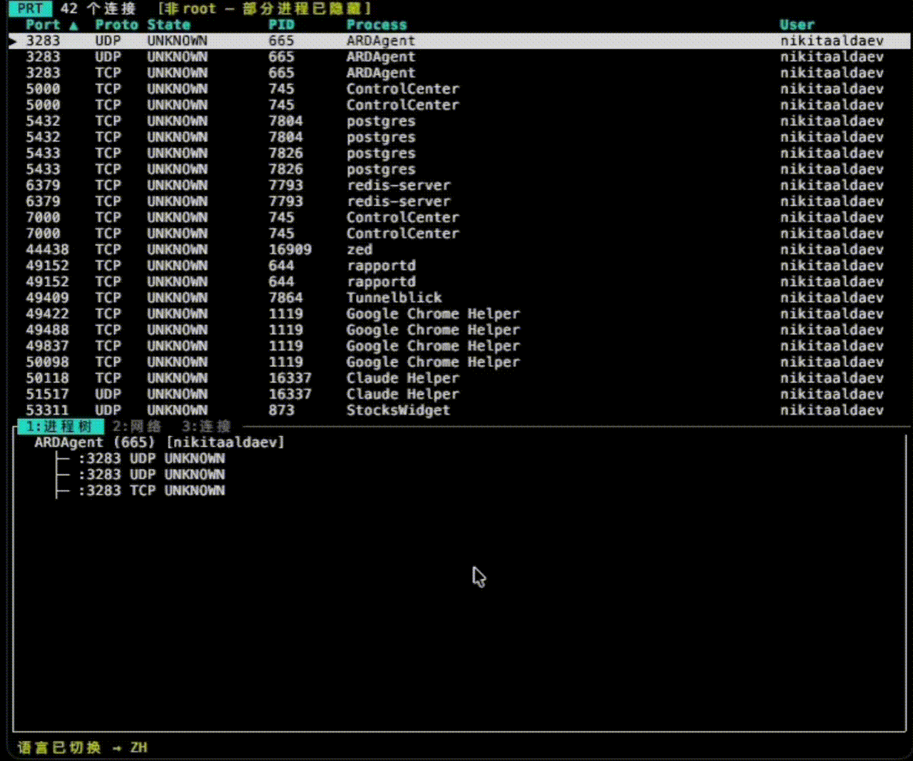

<div align="center">

# prt

**Real-time network port monitor for your terminal**

<br>



<br>
<br>

[](https://crates.io/crates/prt)
[](https://crates.io/crates/prt)
[](https://github.com/rekurt/prt/actions/workflows/ci.yml)
[](LICENSE)
[](https://www.rust-lang.org)
[](https://docs.rs/prt-core)

[English](README.md) | [Русский](README.ru.md) | [中文](README.zh.md)

</div>

---

## What is prt?

`prt` shows which processes occupy network ports on your machine — in real time, right in your terminal. Think of it as a live, interactive `lsof -i` / `ss -tlnp` with colors, filtering, and process trees.

## Features

### Live Table with Change Tracking

The main view displays all active network connections in a sortable, filterable table. Columns include port, service name, protocol, state, PID, process name, and user. New connections flash **green**; closed connections fade **red** for 5 seconds before disappearing. The table auto-refreshes every 2 seconds.

### Known Ports Database

The `Service` column maps well-known port numbers to human-readable names — http (80), ssh (22), postgres (5432), and ~200 more. You can override or extend with custom names in `~/.config/prt/config.toml`:

```toml
[known_ports]
3000 = "my-app"
9090 = "prometheus"
```

### Connection Aging

Every connection tracks its `first_seen` timestamp. ESTABLISHED connections older than 1 hour are highlighted yellow; older than 24 hours — red. CLOSE_WAIT connections are always red as they indicate potential resource leaks.

### Suspicious Connection Detector

Connections are scanned for anomalies and flagged with `[!]`:

- **Non-root on privileged port** — a non-root process listening on port < 1024
- **Script on sensitive port** — Python, Perl, Ruby, or Node.js listening on port 22, 80, or 443
- **Root outgoing to high port** — root process with an established connection to a remote port > 1024

Filter with `/` then type `!` to show only suspicious entries.

### Container Awareness

If Docker or Podman is running, the `Container` column shows which container owns each process. The column auto-hides when no containers are detected to save space. Resolution uses batched `docker ps` + `docker inspect` calls with a 2-second timeout to avoid blocking the TUI.

### Bandwidth Estimation

The header bar shows system-wide network throughput: `▼ 1.2 MB/s ▲ 340 KB/s`. Reads from `/proc/net/dev` on Linux or `netstat -ib` on macOS. Rates are calculated as deltas between refresh cycles.

### Process Tree

Press `Enter` or `d` to open the detail panel, then `1` to see the full parent chain for the selected process (e.g., `launchd → nginx → worker`). Built by traversing PPID relationships.

### Detail Panel Tabs

The bottom panel (toggle with `Enter`/`d`) has three tabs:

| Tab | Key | Content |
|-----|-----|---------|
| **Tree** | `1` | Process parent chain |
| **Network** | `2` | Interface details, IP addresses, MTU |
| **Connection** | `3` | All connections for the selected PID |

### Fullscreen Views

Four dedicated views accessible with keys `4`-`7`:

| View | Key | Description |
|------|-----|-------------|
| **Chart** | `4` | Horizontal bar chart showing connection count per process |
| **Topology** | `5` | ASCII network graph: process → local port → remote host |
| **Process Detail** | `6` | Comprehensive info page: CWD, CPU %, RSS, open files, environment variables, all connections, network interfaces, process tree |
| **Namespaces** | `7` | Network namespace grouping (Linux only). Shows named namespaces from `/run/netns/` or raw inode numbers |

All fullscreen views support scrolling with `j`/`k` and `g`/`G`. Press `Esc` to return to the table.

### Firewall Quick-Block

Press `b` on a connection with a remote address to block that IP. A confirmation dialog shows the exact command that will be executed:

- **Linux:** `iptables -A INPUT -s <IP> -j DROP`
- **macOS:** `pfctl -t prt_blocked -T add <IP>`

The status bar shows the undo command after blocking. Requires sudo privileges.

### Strace / Dtruss Attach

Press `t` to attach a system call tracer to the selected process. The detail panel splits to show a live stream of network-related syscalls:

- **Linux:** `strace -p <PID> -e trace=network -f`
- **macOS:** `dtruss -p <PID>` (requires SIP disabled or root)

Press `t` again to detach. The tracer process is automatically killed on exit.

### SSH Port Forwarding

Press `F` (Shift+F) to create an SSH tunnel for the selected port. A dialog prompts for the remote host:

```
localhost:5432 →
host:port → user@server.io:5432█
```

The tunnel is created via `ssh -N -L <local>:localhost:<remote> <host>`. Active tunnels are shown in the header bar (`⇄ localhost:5432 → server:22`). Tunnels are health-checked each tick and automatically killed on exit via `Drop`.

### Alert Rules

Define rules in `~/.config/prt/config.toml` to get notified when specific conditions are met:

```toml
[[alerts]]
port = 22
action = "bell"        # terminal bell on new SSH connections

[[alerts]]
process = "python"
state = "LISTEN"
action = "highlight"   # highlight row in yellow

[[alerts]]
connections_gt = 100
action = "bell"        # alert when a process exceeds 100 connections
```

Alerts fire only on NEW entries (not every refresh cycle). Available conditions: `port`, `process`, `state`, `connections_gt`. Actions: `bell`, `highlight`.

### NDJSON Streaming

```bash
prt --json | jq '.process.name'
```

Outputs one JSON object per connection per refresh cycle to stdout. Handles SIGPIPE gracefully (no panics when piped to `head`). No TUI initialization — safe for scripts and pipelines.

### Watch Mode

```bash
prt watch 3000 8080 5432
```

Compact non-TUI display showing UP/DOWN status for specific ports. Emits BEL (`\x07`) on state changes. Supports ANSI colors when connected to a TTY, plain text when piped.

```
:3000 ● UP   nginx (1234)   since 14:32:05
:8080 ○ DOWN                 since 14:35:12
:5432 ● UP   postgres (567)  since 14:32:05
```

### Export

```bash
prt --export json    # JSON snapshot of all connections
prt --export csv     # CSV snapshot
```

### Multilingual Interface

English, Russian, and Chinese. Language is resolved:

1. `--lang en|ru|zh` CLI flag (highest priority)
2. `PRT_LANG` environment variable
3. System locale auto-detection
4. English (fallback)

Press `L` in the TUI to switch language at runtime — no restart needed.

## Install

```bash
cargo install prt
```

<details>
<summary><b>Build from source</b></summary>

```bash
git clone https://github.com/rekurt/prt.git
cd prt
make install    # or: cargo install --path crates/prt
```

**Requirements:** Rust 1.75+ · macOS 10.15+ or Linux with `/proc` · `lsof` (macOS — preinstalled)

</details>

## Usage

```bash
prt                     # launch TUI
prt --lang ru           # Russian interface
prt --export json       # export snapshot to JSON
prt --export csv        # export snapshot to CSV
prt --json              # NDJSON streaming to stdout
prt watch 80 443 5432   # compact port watch mode
sudo prt                # run as root (see all processes)
```

## Keyboard Shortcuts

**Navigation:**

| Key | Action |
|-----|--------|
| `j`/`k` `↑`/`↓` | Move selection / scroll |
| `g` / `G` | Jump to top / bottom |
| `/` | Search & filter (`!` = suspicious only) |
| `Esc` | Back to table / clear filter |
| `q` | Quit |

**Bottom panel (Table mode):**

| Key | Action |
|-----|--------|
| `Enter` / `d` | Toggle detail panel |
| `1` `2` `3` | Tree / Network / Connection tab |
| `←`/`→` `h`/`l` | Switch detail tab |

**Fullscreen views:**

| Key | Action |
|-----|--------|
| `4` | Chart — connections per process |
| `5` | Topology — process → port → remote |
| `6` | Process detail — info, files, env |
| `7` | Namespaces (Linux only) |

**Actions:**

| Key | Action |
|-----|--------|
| `K` / `Del` | Kill process |
| `c` | Copy line to clipboard |
| `p` | Copy PID to clipboard |
| `b` | Block remote IP (firewall) |
| `t` | Attach/detach strace |
| `F` | SSH port forward (tunnel) |
| `r` | Refresh |
| `s` | Sudo prompt |
| `Tab` | Next sort column |
| `Shift+Tab` | Reverse sort direction |
| `L` | Cycle language |
| `?` | Help |

## Configuration

Create `~/.config/prt/config.toml`:

```toml
# Override known port names
[known_ports]
3000 = "my-app"
9090 = "prometheus"

# Alert rules
[[alerts]]
port = 22
action = "bell"

[[alerts]]
process = "python"
state = "LISTEN"
action = "highlight"

[[alerts]]
connections_gt = 100
action = "bell"
```

## Architecture

```
crates/
├── prt-core/                  # Core library (platform-independent)
│   ├── model.rs               # PortEntry, TrackedEntry, ViewMode, DetailTab, enums
│   ├── config.rs              # TOML config loading (~/.config/prt/)
│   ├── known_ports.rs         # Well-known port → service name database
│   ├── core/
│   │   ├── scanner.rs         # scan → diff → sort → filter → export
│   │   ├── session.rs         # Refresh cycle state machine
│   │   ├── killer.rs          # SIGTERM / SIGKILL
│   │   ├── alerts.rs          # Alert rule evaluation
│   │   ├── suspicious.rs      # Suspicious connection heuristics
│   │   ├── bandwidth.rs       # System-wide RX/TX rate tracking
│   │   ├── container.rs       # Docker/Podman container resolution
│   │   ├── history.rs         # Connection count history (internal)
│   │   ├── namespace.rs       # Network namespace grouping (Linux)
│   │   ├── process_detail.rs  # CWD, env, files, CPU, RSS
│   │   └── firewall.rs        # iptables/pfctl block/unblock
│   ├── i18n/                  # EN / RU / ZH, AtomicU8-backed runtime switching
│   └── platform/
│       ├── macos.rs           # lsof + batch ps (2 calls/cycle)
│       └── linux.rs           # /proc via procfs
└── prt/                       # TUI binary (ratatui + crossterm + clap)
    ├── app.rs                 # App state, main loop, caching
    ├── ui.rs                  # ViewMode-based rendering, fullscreen views
    ├── input.rs               # Key dispatch by view mode
    ├── stream.rs              # NDJSON streaming mode
    ├── watch.rs               # Port watch mode
    ├── tracer.rs              # Strace/dtruss session management
    └── forward.rs             # SSH tunnel manager
```

**Data flow:**

```
platform::scan_ports() → Session::refresh()
    → diff_entries()        New / Unchanged / Gone (with first_seen carry-forward)
    → retain()              remove Gone after 5s
    → enrich()              service names, suspicious flags, containers
    → sort_entries()        by current SortState
    → filter_indices()      user's search query
    → alerts::evaluate()    fire bell/highlight alerts
    → UI renders            ViewMode-based routing
```

| Platform | Method | Performance |
|----------|--------|-------------|
| **macOS** | `lsof -F` structured output | 2 `ps` calls per scan cycle (batch) |
| **Linux** | `/proc/net/` via `procfs` | Zero subprocess overhead |

## Development

```bash
cargo build --workspace          # build everything
cargo test --workspace           # run all tests (188 tests)
cargo clippy --workspace         # lint
cargo fmt --all -- --check       # format check
cargo bench -p prt-core          # criterion benchmarks
```

See [CONTRIBUTING.md](CONTRIBUTING.md) for guidelines.

## License

[MIT](LICENSE)
