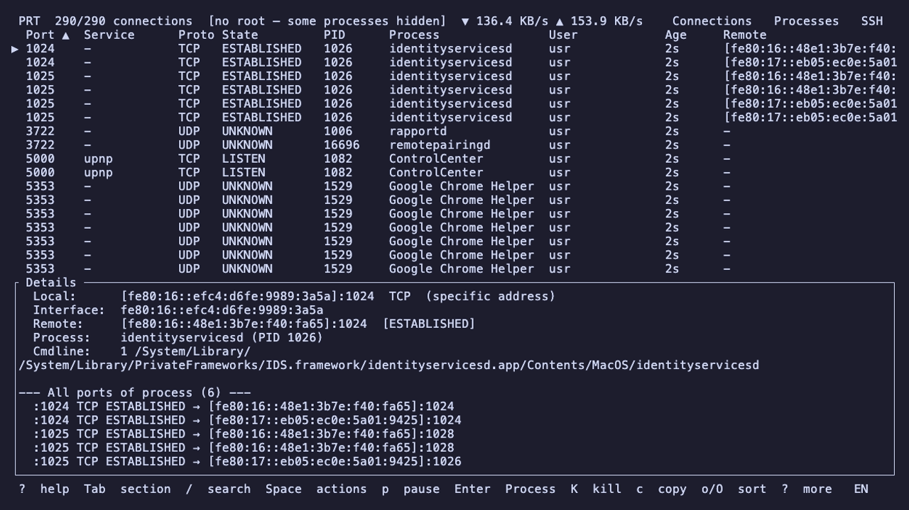

<div align="center">

# prt

**See which processes own your network ports — live, from the terminal.**

[](https://crates.io/crates/prt)
[](https://crates.io/crates/prt)
[](https://github.com/rekurt/prt/actions/workflows/ci.yml)
[](LICENSE)
[](https://www.rust-lang.org)
[](https://docs.rs/prt-core)

[English](README.md) · [Русский](README.ru.md) · [中文](README.zh.md)

</div>

`prt` is a keyboard-driven terminal UI for inspecting network connections, finding port conflicts, exploring process details, and managing SSH tunnels on macOS and Linux. It combines a live connection table with filtering, change tracking, process topology, alerts, and script-friendly output.

## Demo

<p align="center">
  
</p>

The 13-second demo plays directly in the README. You can also [view a static frame](docs/prt-demo.png) or [read the demo transcript](docs/demo-transcript.md). The recording is reproducible from [`docs/demo.tape`](docs/demo.tape).

## Quick start

### Requirements

- Rust 1.75 or newer for installation with Cargo
- macOS 10.15 or newer with the built-in `lsof`
- Linux with a mounted `/proc` filesystem
- A UTF-8 terminal; a wider window gives the table more room

### Install and run

```sh
cargo install prt
prt
```

Run `sudo prt` when the operating system hides processes owned by other users. Elevated privileges are not required for normal use.

To build the current source instead:

```sh
git clone https://github.com/rekurt/prt.git
cd prt
cargo install --path crates/prt
```

## What you can do

| Task | How `prt` helps |
|---|---|
| Find a port conflict | Search by port, process, protocol, state, service, PID, or user |
| Follow connection changes | Refresh every two seconds; new and closed entries are highlighted |
| Investigate a process | Inspect command line, parent tree, CPU, memory, open files, and related connections |
| Review network topology | See `process → local port → remote endpoint` as a terminal tree |
| Spot suspicious listeners | Filter entries flagged with `[!]` by the built-in heuristics |
| Work with containers | Show the owning Docker or Podman container when one is detected |
| Manage SSH forwarding | Read hosts from SSH config and create, restart, edit, or save tunnels |
| Automate checks | Export one snapshot as JSON/CSV or stream NDJSON continuously |

`prt` also estimates system-wide bandwidth, maps common ports to service names, supports configurable alerts, and offers contextual actions for process termination, firewall blocking, copying, tracing, and SSH forwarding.

## Command-line modes

```sh
prt                         # launch the interactive TUI
prt --lang ru               # start in Russian (en, ru, or zh)
prt --export json           # print one JSON snapshot and exit
prt --export csv            # print one CSV snapshot and exit
prt --json                  # continuously stream NDJSON
prt watch 80 443 5432       # compact UP/DOWN monitor for selected ports
sudo prt                    # include processes hidden from the current user
```

Use `--export` for a finite snapshot. `--json` keeps running and emits one object per connection on each scan cycle; it stops cleanly when a downstream command such as `head` closes the pipe.

Examples:

```sh
# Save a snapshot for comparison or incident notes.
prt --export json > ports.json

# Show process names from the live stream.
prt --json | jq -r '.process.name'

# Watch only development ports.
prt watch 3000 5432 8080
```

## Interface guide

`Tab` and `Shift+Tab` move between three top-level sections:

| Section | Purpose | Sub-tabs |
|---|---|---|
| Connections | Sortable connection table and optional details panel | None |
| Processes | Details for the selected process and its network topology | Detail, Topology |
| SSH | Hosts loaded from SSH config and managed tunnels | Hosts, Tunnels |

Press `?` at any time for the in-app cheat sheet. Press `:` to search the command palette when remembering a shortcut is inconvenient.

### Keyboard reference

| Key | Action |
|---|---|
| `?` | Open the help screen; any key closes it |
| `q` | Quit |
| `Tab` / `Shift+Tab` | Next / previous section |
| `Space` | Open the contextual action menu |
| `:` | Open the searchable command palette |
| `/` | Search and filter; press `Esc` twice to clear a non-empty filter |
| `p` | Pause or resume automatic refresh |
| `r` | Refresh now |
| `s` | Enter a sudo password when more process visibility is needed |
| `L` | Cycle the interface language |
| `j` / `k`, `↑` / `↓` | Move or scroll |
| `g` / `G`, `Home` / `End` | Jump to the beginning or end |
| `K` / `Delete` | Ask to terminate the selected process |
| `c` | Copy the selected connection |

Section-specific keys:

| Context | Key | Action |
|---|---|---|
| Connections | `Enter` | Open the selected process in the Processes section |
| Connections | `d` | Show or hide the bottom details panel |
| Connections | `o` / `O` | Choose the next sort column / reverse sort direction |
| Processes | `[` / `]` | Switch between Detail and Topology |
| SSH | `[` / `]` | Switch between Hosts and Tunnels |
| SSH Hosts | `Enter` | Start a tunnel form for the selected host |
| SSH Hosts | `r` | Reload SSH and `prt` configuration |
| SSH Tunnels | `n` / `e` | Create / edit a tunnel |
| SSH Tunnels | `K` / `r` / `s` | Kill / restart / save tunnels |

## Search and change tracking

Type `/` to filter the live table. Plain text matches visible connection data; status aliases such as `new`, `gone`, and `active` can narrow the lifecycle state. Type `!` or `suspicious` to show entries flagged by the suspicious-connection detector.

New entries are green. Closed entries are dimmed red and remain visible for five seconds. Connection state and age remain available as text, but the new/gone distinction is currently color-based.

## Configuration

The optional configuration file is `~/.config/prt/config.toml`. A missing file uses defaults; a parse error is reported and defaults are used.

```toml
# Add or override service names.
[known_ports]
3000 = "frontend"
5432 = "postgres"

# Ring the terminal bell for a new SSH connection.
[[alerts]]
port = 22
action = "bell"

# Highlight Python listeners.
[[alerts]]
process = "python"
state = "LISTEN"
action = "highlight"

# Add a host alongside entries from ~/.ssh/config.
[[ssh_hosts]]
alias = "staging"
hostname = "staging.example.com"
user = "deploy"
port = 22
```

Alert conditions are `port`, `process`, `state`, and `connections_gt`. Actions are `bell` and `highlight`. Bell alerts fire only for new entries.

The SSH section also reads `~/.ssh/config`. Saved tunnels are written back to the `[[ssh_tunnels]]` section of the `prt` config by the Tunnels view.

## Safety and permissions

Scanning and navigation are read-only. Actions that change system state are grouped in the `Space` menu:

- Process termination asks you to choose SIGTERM or SIGKILL.
- Firewall blocking shows a confirmation and requires suitable privileges.
- System-call tracing requires `ptrace` permissions on Linux or suitable `dtruss` permissions on macOS.
- SSH forwarding starts an `ssh` subprocess using the values shown in the tunnel form.

Review the confirmation or form before proceeding. See the [security policy](SECURITY.md) for vulnerability reporting and the supported release policy.

## Documentation accessibility

- The README begins with a copyable quick start and uses descriptive link text.
- The demo has a non-animated preview, descriptive alternative text, and a text transcript.
- The TUI is fully keyboard-driven and includes an in-app help screen and command palette.
- English, Russian, and Chinese interfaces and READMEs are available.
- Connection states and suspicious entries have text labels; new/gone lifecycle cues are currently color-based.
- Non-interactive JSON, CSV, NDJSON, and watch modes provide alternatives to the full-screen TUI.

If the terminal interface itself is not usable with your assistive technology, `prt --export json` is the most predictable machine-readable alternative.

## Architecture

The repository is a Rust workspace with two crates:

```text
crates/
├── prt-core/   scanning, tracking, filtering, alerts, configuration,
│               process details, containers, i18n, and platform adapters
└── prt/        clap CLI, ratatui interface, input handling, streaming,
                watch mode, tracing, and SSH tunnel management
```

The main refresh flow is:

```text
platform scan
  → Session refresh
  → diff New / Unchanged / Gone entries
  → enrich services, suspicious flags, and containers
  → retain recently closed entries
  → sample bandwidth and sort
  → evaluate alerts, filter, and render
```

macOS scans structured `lsof` output and batches process metadata lookups. Linux reads `/proc/net` through the `procfs` crate.

Library users can read the [`prt-core` API documentation](https://docs.rs/prt-core). Contributors should start with [CONTRIBUTING.md](CONTRIBUTING.md).

## Development

```sh
cargo build --workspace
cargo test --workspace
cargo clippy --workspace --all-targets -- -D warnings
cargo fmt --all -- --check
```

## License

Licensed under the [MIT License](LICENSE).

If `prt` is useful to you, consider [starring the project on GitHub](https://github.com/rekurt/prt).
