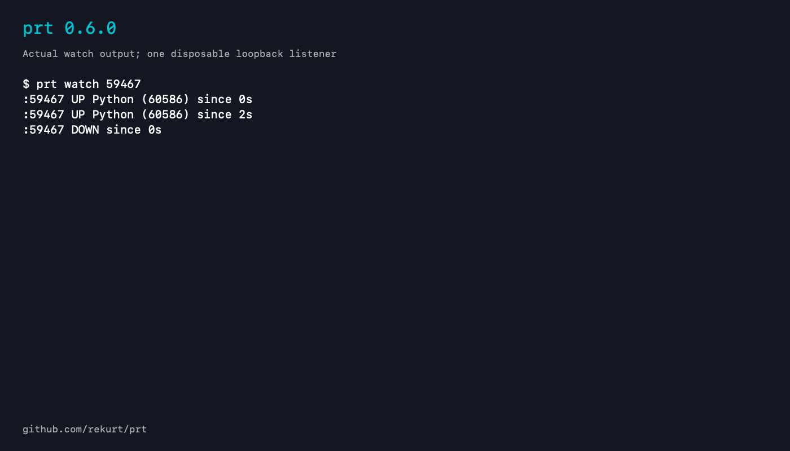

# prt command-line example

Version: `prt 0.6.0`. This is actual captured command output rendered into a static PNG, not a TUI screenshot or a new recording.

The listener and its process belong to the disposable fixture. Port and PID values are ephemeral test identifiers. No private hosts or unrelated processes were recorded.

[Plain-text transcript](prt-watch-demo.txt)

The preview and accompanying documentation were prepared with AI assistance.
